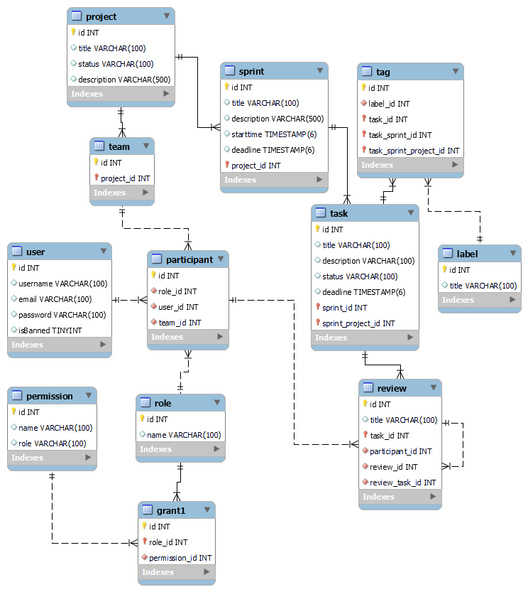

# Проєктування бази даних

## Модель бізнес-об'єктів

@startuml

entity User #FF3399
entity User.username #FFFAFF
entity User.email #FFFAFF
entity User.password #FFFAFF
entity User.isBanned #FFFAFF

entity Participant #FF3399

entity Role #FF3399
entity Role.name #FFFAFF

entity Grant #FF3399

entity Permission #FF3399
entity Permission.name #FFFAFF
entity Permission.role #FFFAFF

entity Project #FF3399

entity Project.title #FFFAFF
entity Project.status #FFFAFF
entity Project.description #FFFAFF

entity Team #FF3399

entity Sprint #FF3399

entity Sprint.title #FFFAFF
entity Sprint.description #FFFAFF
entity Sprint.starttime #FFFAFF
entity Sprint.deadline #FFFAFF

entity Task #FF3399
entity Task.title #FFFAFF
entity Task.description #FFFAFF
entity Task.status #FFFAFF
entity Task.deadline #FFFAFF

entity Tag #FF3399

entity Label #FF3399
entity Label.title #FFFAFF

entity Review #FF3399
entity Review.title #FFFAFF

User.username -d-* User
User.password -d-* User
User.email -u-* User
User.isBanned -u-* User

Role.name -u-* Role

Permission.name -u-* Permission
Permission.role -u-* Permission

Project.title -d-* Project
Project.status -d-* Project
Project.description -d-* Project

Sprint.title -d-* Sprint 
Sprint.description -d-* Sprint 
Sprint.starttime -d-* Sprint 
Sprint.deadline -l-* Sprint 

Label.title -u-* Label

Review.title -u-* Review

Task.title -l-* Task
Task.description -l-* Task
Task.status -l-* Task
Task.deadline -r-* Task

User "1, 1"-r-"0, *" Participant
Participant "0, *"-d-"1, 1" Role
Role "1, 1"-d-"0, *" Grant
Grant "0, *"-d-"1, 1" Permission
Team "1, 1"-d-"0, *" Participant
Project "1, 1"-d-"0, *" Team
Sprint "0, *"-l-"1, 1" Project
Task "0, *"-u-"1, 1" Sprint
Review "0, 1"-u-"0, *" Review
Label "1, 1"-u-"0, *" Tag
Tag "0, *"-u-"1, 1" Task
Review "0, *"-u-"1, 1" Task
Review "0, *"-l-"1, 1" Participant

@enduml

## ER-модель

@startuml

package TaskManage {
    entity Task  { 
              id: int
              title: text
              status: text
              description: text
              deadline: timestamp
    }
    entity Tag {
    }
    entity Label {
               id: int
               title: text
    }
    entity Sprint {
                id: int
                title: text
                description: text
                deadline: timestamp
                starttime: timestamp
    }
}

package ReviewManage {
    entity Review { 
              id: int
              title: text
    }
}

package ProjectManage {
    entity Project {
                id: int
                title: text
                status: enum
                description: text

    }
}

package Team {
    entity Participant {
        id: int
        role: enum
    }
}

package AccountManage{
    entity User {
    id: int
    login: text
    password: text
    mail: text
    name: text
    roleID: int
    orgListID: int
}
}

package AccessControl {
    entity Role {
        id: int
        name: text
        description: text
    }

    entity Permission {
        id: int
        name: text
    }

    entity Grant {  
    }
}

Task "1,1" -d-- "0,*" Tag
Tag "0,*" -d-- "1,1" Label

Review "0,*" -r-- "1,1" Task
Sprint "0,*" -d-- "1,1" Task
Sprint "0,*" -l-- "1,1" Project
Project "1,1" -d-- "0,*" Team

User "1.1" -d-- "0.*" Permission
User "0,*" -u-- "1,1" Participant 
Grant "0,*" -r-> "1,1" Role
Grant "0,*" -l-> "1,1" Permission

@enduml

## Реляційна схема

