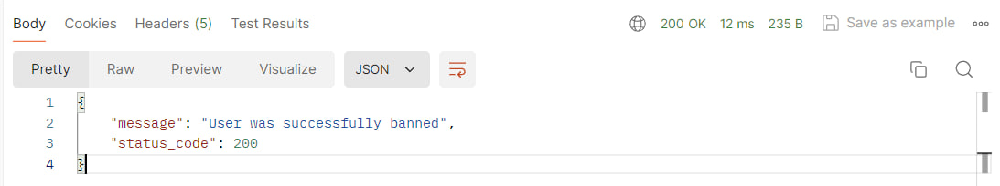

# Тестування працездатності системи
Для тестування системи використовувся додаток Postman

## Запуск сервера
 

## Метод GET

### GET /users
#### Запит
 

#### Відповідь
 
 
### GET /user/\<id\>
#### Запит
 

#### Відповідь
 
 
### GET /user/\<id\> ERROR
#### Запит
 

#### Відповідь
 
 
### POST /user/add
#### Запит
 

#### Відповідь
 
 
#### Перевірка
 
 
 
### PATCH /user/update
#### Запит
 

#### Відповідь
 
 
#### Перевірка
 
 
 
### DELETE /user/delete/\<id\>
#### Запит
 

#### Відповідь
 
 
#### Перевірка
 

### DELETE /user/delete/\<id\> ERROR
#### Запит
 

#### Відповідь
 

### PATCH /user/ban/\<id\>
#### Запит
 

#### Відповідь
 
 
#### Перевірка
 

### PATCH /user/unban/\<id\>
#### Запит
 

#### Відповідь
 
 
#### Перевірка
 